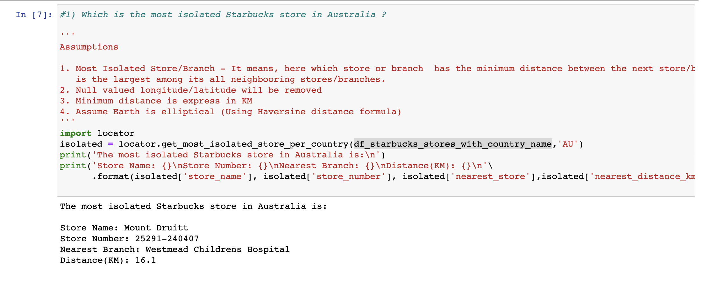

# Coding Challenge - Starbucks Store Locator

## Description:

*Exercise

Write clean Pyspark code to answer any two of the following questions. 
Please refrain from using embedded queries in the code. Pyspark.sql.functions is preferred over sql queries.

Proper comments and unit test cases are appreciated. The way the answer is approached is as important as the answer itself.

Share the output & the code via a github repo.

*Questions :

1) Which is the most isolated Starbucks store in Australia ?
2) Which country has the least number of Starbucks stores ?
3) How many stores in Sydney has not updated the "Phone Number" in this dataset ?
4) Which city has the highest number of "Company Owned" Starbuck stores ?

## About Dataset
	
Starbucks started as a roaster and retailer of whole bean and ground coffee, tea and spices with a single store in Seattle’s Pike Place Market in 1971. The company now operates more than 24,000 retail stores in 70 countries.

This is a public dataset which includes a record for every Starbucks or subsidiary store location currently in operation as of February 2017. It includes information about the Store Number, Store Name, Ownership Type, Street Address, City, State/Province, Country, Postcode, Phone Number, Timezone, Longitude and Latitude

## Setup Requirements
  1. Python 3 Environment + Jupyter Notebook
  2. PySpark, Spark, Pytest
  3. Venv(Optional)

## Setting up Virtual Environment
  1. mkdir python3_env
  2. python3 -m venv python3_env
  3. source python3_env/bin/activate

## Spark Settings

`export JAVA_HOME=(/usr/libexec/java_home -v 1.8)`
`export SPARK_PATH=/Users/francisco.liwa/spark-2.4.4-bin-hadoop2.7`
`export PYSPARK_DRIVER_PYTHON="jupyter"`
`export PYSPARK_DRIVER_PYTHON_OPTS="notebook"`
`export PYSPARK_PYTHON=python3`
`alias snotebook='$SPARK_PATH/bin/pyspark --master local[2]'`

## Getting the code
  1. git clone <qantas_coding_exercise_repo>
  2. cd qantas
  3. pip install -r requirements.txt

## Running Test
  1. cd qantas
  2. run pytest
    `pytest`

## Running App

  1. cd qantas
  2. run jupyter notebook
     `pyspark` 
  3. run solutions.ipynb

## Sample Output

1.  Question #1
    
2.  Question #2
       

### Author
    fliwa_2019

